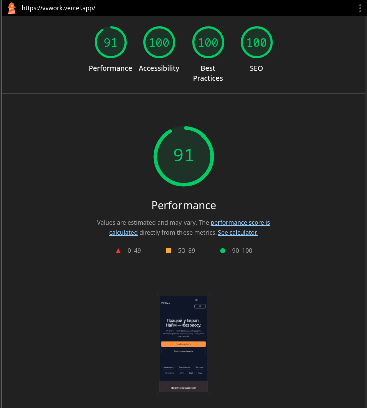

# VV Work

Платформа для пошуку роботи в Європі та підбору працівників для роботодавців. Тестове завдання: три сторінки (Головна, сторінка партнера, Контакти), спроєктовані й зверстані в коді без Figma.

## Стек

- Vite + React 19 + TypeScript
- Tailwind CSS v4
- React Router v7 (з `React.lazy`/`Suspense` для сторінок партнера й контактів)
- Vitest + Testing Library — юніт-тести

## Запуск проєкту

```bash
npm install

npm run dev       # dev-сервер (localhost:5173)
npm run build     # прод-білд у dist/
npm run preview   # локальний перегляд зібраного прод-білду
npm run lint      # eslint

npm run test              # юніт-тести
npm run test -- --coverage  # тести з підрахунком покриття
```

## Деплой

https://vvwork.vercel.app/

## Архітектура

```
src/
  app/            # конфігурація роутера (react-router-dom)
  layouts/        # MainLayout — Header + <Outlet/> + Footer
  pages/          # по одному файлу на сторінку/роут
  components/
    layout/        Header, Nav, NavLinks, Footer, Logo
    home/           Hero, CategoriesBlock, CategoryCard, EmployerCTA
    vacancies/      VacancyList, VacancyCard (React.memo)
    application-form/ ApplicationForm
    ui/             Input, Button, Skeleton, RetryBlock — перевикористовувані примітиви
  hooks/          useDebounce, useCategoryFilter, useAsyncData, usePageMeta, useTheme
  api/            fakeApi.ts — мокова fetch-обгортка (затримка 300–800мс + ~20% помилка)
  utils/          validators.ts — чисті функції валідації форми
  types/          типи + мокові дані (Category, Vacancy, Partner)
```

Стейт-менеджмент — без Redux/Zustand, звичайний `useState` + кастомні хуки (детальніше — у блоці "Мої рішення" нижче).

## Тести

Покриті юніт-тестами три місця, явно згадані в брифі:

- **`utils/validators.test.ts`** — валідація ім'я (мін. 2 символи), телефону/telegram (формат), повідомлення (опційне, до 500 символів).
- **`hooks/useDebounce.test.ts`** — початкове значення, відсутність оновлення до завершення затримки, оновлення після затримки, врахування лише останньої зміни при швидкому введенні.
- **`hooks/useAsyncData.test.ts`** — переходи станів `loading → success`, `loading → error`, і повторний запит через `refetch` після невдачі.

Покриття цих трьох файлів — **100%** (statements/branches/functions/lines), перевірено через `vitest --coverage`.

## Lighthouse (продакшн-білд, Головна сторінка)



Performance 91 / Accessibility 100 / Best Practices 100 / SEO 100 (мобільний профіль, https://vvwork.vercel.app/).

## Мої рішення

- **Структура Головної** — Hero одразу пояснює цінність платформи, далі блок категорій (як точка входу до пошуку вакансій), і в кінці — окремий блок для роботодавців. Такий порядок веде користувача від "що це" до конкретної дії.
- **Фільтр за категорією через query-параметр** — клік по категорії веде на `/partners/:slug?category=...`. Оскільки в межах брифу існує лише сторінка одного конкретного партнера (а не загальний список вакансій по всіх партнерах), це свідоме спрощення: посилання на слаг конкретного партнера з переданим фільтром — а не окрема сторінка пошуку, якої брифом не передбачено.
- **Стейт-менеджмент без Redux/Zustand** — увесь стан (пошук, фільтр категорії, async-дані, форма) вкладається у звичайні `useState` + кілька кастомних хуків (`useDebounce`, `useCategoryFilter`, `useAsyncData`). Обсяг стану в проекті не виправдовує окрему бібліотеку.
- **Без зайвих ре-рендерів списку вакансій** — `VacancyCard` обгорнутий у `React.memo`, `key` — стабільний `id` вакансії (не індекс масиву), а фільтрація за назвою й категорією відбувається в одному об'єднаному `filter()`, а не в кількох послідовних обчисленнях.
- **Що змінили в брифі** — посилання без реальної сторінки (наприклад, "Про нас", частина пунктів Footer) навмисно неактивні (звичайний текст, не `Link`) замість того, щоб мовчки вести на Головну. Додатково понад бриф — маршрути `/partners/:slug` і `/контакти` завантажуються ліниво через `React.lazy`/`Suspense`, що зменшує початковий бандл Головної сторінки.

## Відхилення від брифу

- **Категорії ведуть на конкретного партнера, а не на загальний список вакансій** — у брифі описана лише одна динамічна сторінка партнера, без сторінки-агрегатора всіх вакансій. Клік по категорії (і на Головній, і в самому фільтрі на сторінці партнера) працює через `?category=` для мокового партнера `euro-logistics`.
- **Посилання без реальної сторінки** (частина пунктів Header/Footer — "Про нас", "Політика конфіденційності" тощо) залишені неактивними (звичайний текст), а не ведуть в нікуди чи на Головну — чесніше показувати, що сторінки немає, ніж імітувати робоче посилання.
- **Контакти доступні за `/contacts`, а не кириличним `/контакти`** — технічне спрощення роутингу, зміст сторінки той самий.
- **Понад бриф**: lazy-loading сторінок партнера й контактів (`React.lazy`/`Suspense`) для зменшення початкового бандла Головної — впливає на Lighthouse Performance.
- **Понад бриф**: динамічні `<title>`/`<meta name="description">` для кожної сторінки (`usePageMeta`) — для сторінки партнера заголовок включає назву партнера. Впливає на SEO-показник Lighthouse.
- **Понад бриф**: ручне перемикання світлої/темної теми (кнопка в Header, `useTheme`), окрім автоматичної через `prefers-color-scheme` — вибір зберігається в `localStorage`.
